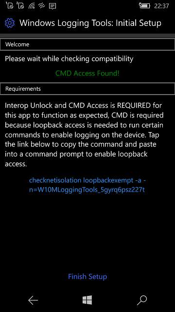
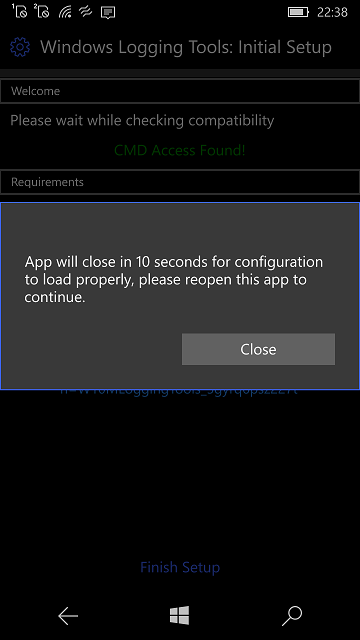
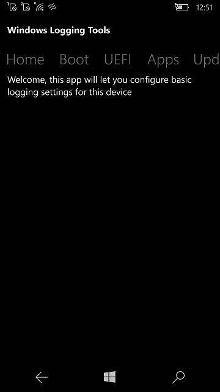
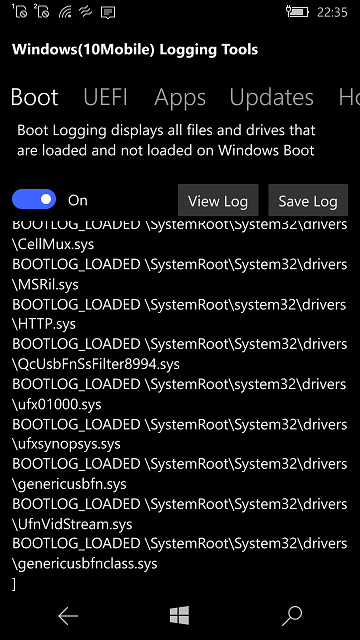
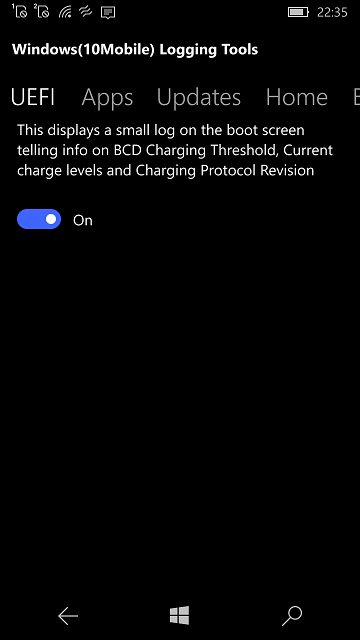
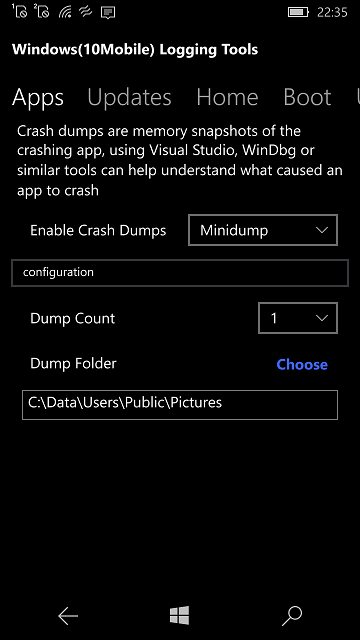
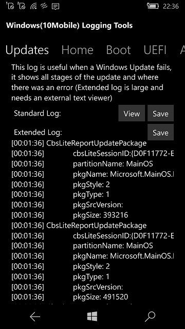
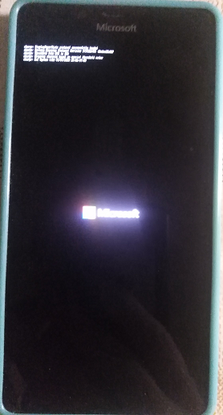

# W10MLoggingTools 0.1.1

:: [Windows Logging Tools for Windows 10 Mobile devices](https://github.com/Empyreal96/WP-Logging-Tools) :: by Empyreal96

## About 
This tool allows you to enable and view logs for a few different aspects of Windows 10 Mobile

## Screenshots

## My 2 cents
- WP-Logging-Tools research provided
- W10MLoggingTools "generated" (with minimal changes at async-await logics...)

## Types of logging available?
- Windows Boot Logging (What drivers and files are loaded on startup)
- On-screen UEFI Charging log
- Image Update logs (i.e Windows Update)
- Enabling app crash dumps

## Requirements:
- Interop Unlocked
- CMD access
- WindowsMobile 10 build 10240 - 17763 ;)

This is currently WIP so UI and features may change before release

## References :: Credits
- [Empyreal96](https://github.com/Empyreal96) for cool WP-Logging-Tools src code :)
- [Bashar Astifan](https://github.com/basharast) with help testing
- NDTKLib creator (Gustave Monce?) for the NDTK library
- [Fadil Fadz](https://github.com/fadilfadz01) for CMD Injector

## ..
AS IS :: No support :: RnD only :: DIY

## .
m][e :: January, 7 2023
